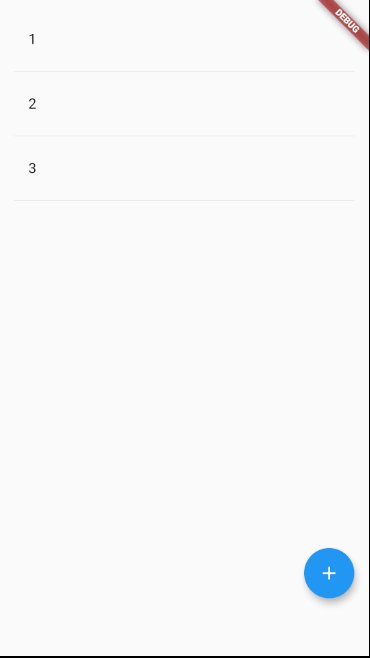
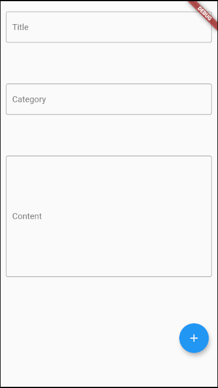
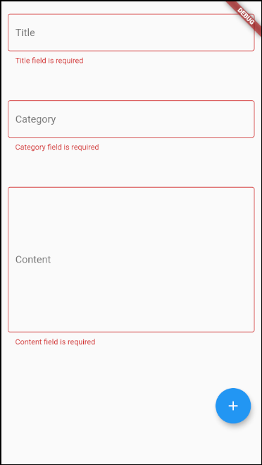
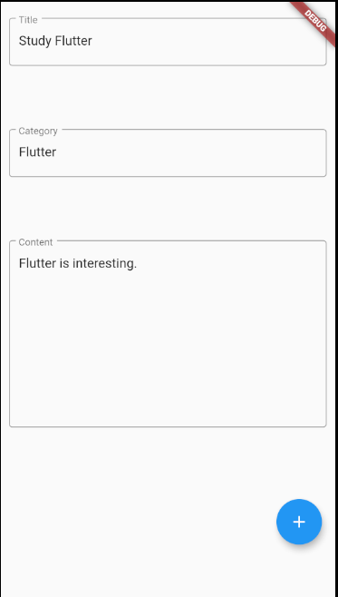
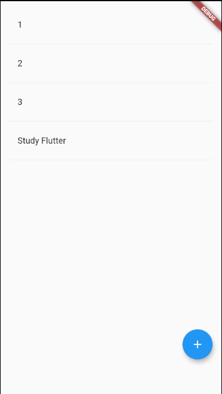

# Flutter Todo example

This project is SUPER SIMPLE Flutter Todo example for newbies.

It uses mobx, mobx-flutter to reflects changes of todo data to ListView immediately. 

Contains

Routing(main screen beween todo creation screen), Input validation(Checks if every TextField's text aren't empty) 

Enjoy Flutter! 
